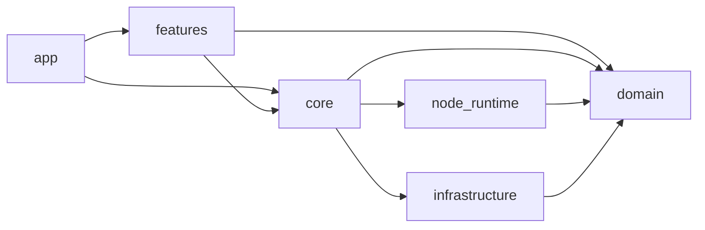
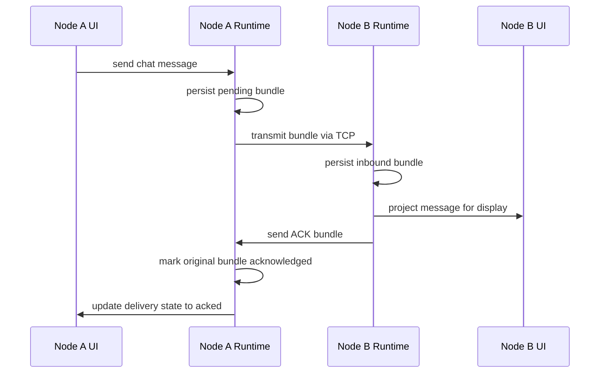
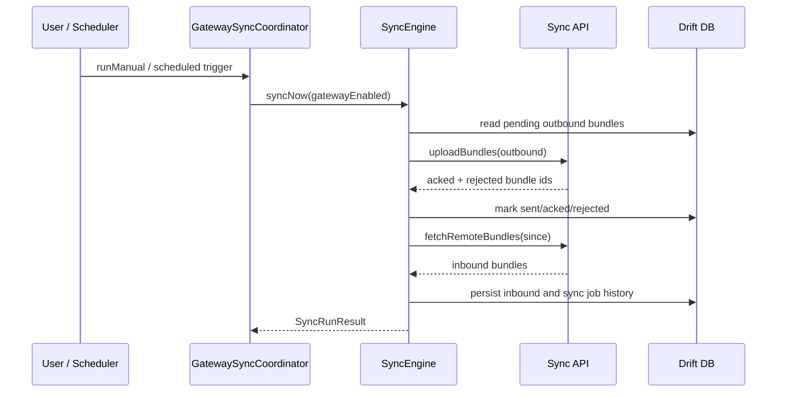

# Architecture and Sequence Diagrams

## Layered Architecture

```mermaid
flowchart LR
  APP[app]
  FEATURES[features]
  CORE[core]
  NODE[node_runtime]
  INFRA[infrastructure]
  DOMAIN[domain]

  APP --> FEATURES
  APP --> CORE
  FEATURES --> CORE
  FEATURES --> DOMAIN
  CORE --> NODE
  CORE --> INFRA
  CORE --> DOMAIN
  NODE --> DOMAIN
  INFRA --> DOMAIN
```

## Offline Chat Delivery Sequence

```mermaid
sequenceDiagram
  participant AUI as Node A UI
  participant ARuntime as Node A Runtime
  participant BRuntime as Node B Runtime
  participant BUI as Node B UI

  AUI->>ARuntime: send chat message
  ARuntime->>ARuntime: persist pending bundle
  ARuntime->>BRuntime: transmit bundle via TCP
  BRuntime->>BRuntime: persist inbound bundle
  BRuntime->>BUI: project message for display
  BRuntime->>ARuntime: send ACK bundle
  ARuntime->>ARuntime: mark original bundle acknowledged
  ARuntime->>AUI: update delivery state to acked
```

## Gateway Sync Sequence

```mermaid
sequenceDiagram
  participant UI as User / Scheduler
  participant Coordinator as GatewaySyncCoordinator
  participant Engine as SyncEngine
  participant API as Sync API
  participant DB as Drift DB

  UI->>Coordinator: runManual / scheduled trigger
  Coordinator->>Engine: syncNow(gatewayEnabled)
  Engine->>DB: read pending outbound bundles
  Engine->>API: uploadBundles(outbound)
  API-->>Engine: acked + rejected bundle ids
  Engine->>DB: mark sent/acked/rejected
  Engine->>API: fetchRemoteBundles(since)
  API-->>Engine: inbound bundles
  Engine->>DB: persist inbound and sync job history
  Engine-->>Coordinator: SyncRunResult
```
